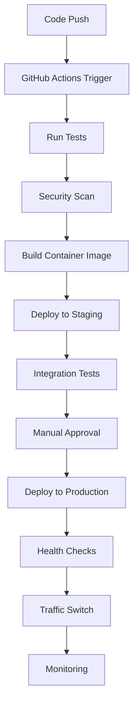

# Deployment Process Guide

This guide explains the deployment process for the Jobs application using the CI/CD pipeline.

## Overview

The CI/CD pipeline supports three deployment environments:
- **Development**: For feature development and testing
- **Staging**: For integration testing and pre-production validation
- **Production**: For live application serving users

## Deployment Strategy

### Blue-Green Deployment

The pipeline uses blue-green deployment strategy to minimize downtime:

1. **Blue Environment**: Currently running production version
2. **Green Environment**: New version being deployed
3. **Traffic Switch**: Instant switch from blue to green after validation
4. **Rollback**: Quick switch back to blue if issues occur

### Deployment Flow



## Deployment Environments

### Development Environment

**Trigger**: Push to feature branches
**Target**: http://192.168.68.89:3000
**Purpose**: Feature development and unit testing

**Configuration:**
- Automatic deployment on push
- Debug logging enabled
- Mock external services
- Reduced resource limits

### Staging Environment

**Trigger**: Push to `develop` branch
**Target**: http://192.168.68.89:8080
**Purpose**: Integration testing and QA validation

**Configuration:**
- Automatic deployment after tests pass
- Production-like environment
- Real external service connections
- Full monitoring enabled

### Production Environment

**Trigger**: Push to `main` branch
**Target**: http://192.168.68.89:80
**Purpose**: Live application serving users

**Configuration:**
- Manual approval required
- Blue-green deployment
- Full backup before deployment
- Comprehensive health checks
- Automatic rollback on failure

## Deployment Process

### Automated Deployment (Staging)

1. **Code Changes:**
   ```bash
   git checkout develop
   git pull origin develop
   # Make changes
   git add .
   git commit -m "feat: add new feature"
   git push origin develop
   ```

2. **Pipeline Execution:**
   - Tests run automatically
   - Security scans execute
   - Container image builds
   - Deployment to staging occurs
   - Health checks validate deployment

3. **Validation:**
   - Check staging environment: http://192.168.68.89:8080
   - Run integration tests
   - Verify functionality

### Production Deployment

1. **Create Pull Request:**
   ```bash
   git checkout main
   git pull origin main
   git merge develop
   git push origin main
   ```

2. **Manual Approval:**
   - Review changes in GitHub
   - Approve deployment in GitHub Actions
   - Monitor deployment progress

3. **Deployment Execution:**
   - Pre-deployment backup
   - Blue-green deployment
   - Health checks
   - Traffic switch
   - Post-deployment validation

## Manual Deployment

### Using Deployment Scripts

For manual deployments or troubleshooting:

```bash
# SSH to target server
ssh deploy@192.168.68.89

# Deploy specific version
./scripts/deploy-blue-green.sh production ghcr.io/company/jobs:v1.2.3

# Check deployment status
./scripts/health-check.sh production

# Rollback if needed
./scripts/rollback.sh production
```

### Emergency Deployment

For critical hotfixes:

```bash
# Create hotfix branch
git checkout -b hotfix/critical-fix main

# Make minimal changes
# ... fix code ...

# Commit and push
git add .
git commit -m "hotfix: critical security fix"
git push origin hotfix/critical-fix

# Create emergency PR to main
# Merge after review
```

## Deployment Validation

### Pre-Deployment Checks

Before any production deployment:

1. **Code Quality:**
   - All tests pass
   - Code review completed
   - Security scan clean
   - No critical vulnerabilities

2. **Environment Readiness:**
   - Target server healthy
   - Sufficient resources available
   - Backup completed
   - Monitoring active

3. **Dependencies:**
   - Database migrations ready
   - External services available
   - Configuration updated

### Post-Deployment Validation

After deployment completion:

1. **Health Checks:**
   ```bash
   # Application health
   curl http://192.168.68.89/health
   
   # Database connectivity
   curl http://192.168.68.89/api/status
   
   # Metrics endpoint
   curl http://192.168.68.89/metrics
   ```

2. **Functional Testing:**
   - User registration works
   - Job search functions
   - Authentication works
   - File uploads work

3. **Performance Validation:**
   - Response times acceptable
   - Resource usage normal
   - No error spikes in logs

4. **Monitoring Verification:**
   - Metrics flowing to Prometheus
   - Dashboards showing data
   - Alerts configured correctly

## Rollback Procedures

### Automatic Rollback

The pipeline automatically rolls back if:
- Health checks fail after deployment
- Error rate exceeds threshold
- Response time degrades significantly

### Manual Rollback

```bash
# SSH to target server
ssh deploy@192.168.68.89

# Execute rollback
./scripts/rollback.sh production

# Verify rollback success
./scripts/health-check.sh production

# Check application functionality
curl http://192.168.68.89/health
```

### Rollback Types

1. **Container Rollback**: Switch to previous container
2. **Data Rollback**: Restore from backup
3. **Configuration Rollback**: Revert configuration changes

## Deployment Monitoring

### Real-time Monitoring

During deployment, monitor:

1. **GitHub Actions**: Pipeline progress
2. **Grafana Dashboards**: System metrics
3. **Application Logs**: Error rates
4. **Health Endpoints**: Service availability

### Key Metrics

- **Deployment Duration**: Target < 5 minutes
- **Success Rate**: Target > 99%
- **Rollback Rate**: Target < 1%
- **Downtime**: Target = 0 seconds

### Alerts

Critical alerts during deployment:
- Container startup failures
- Health check failures
- High error rates
- Resource exhaustion

## Configuration Management

### Environment-Specific Configurations

Each environment has its own configuration:

```bash
# Development
configs/development.env

# Staging  
configs/staging.env

# Production
configs/production.env
```

### Configuration Updates

1. **Non-sensitive changes**: Update in repository
2. **Sensitive changes**: Update via secure deployment
3. **Database changes**: Use migration scripts

### Secrets Management

- Store secrets in GitHub Secrets
- Use environment-specific secret names
- Rotate secrets regularly
- Never commit secrets to repository

## Database Migrations

### Migration Process

1. **Create Migration:**
   ```bash
   # Create migration script
   npm run migration:create add_new_column
   ```

2. **Test Migration:**
   ```bash
   # Test on development
   npm run migration:run
   
   # Test rollback
   npm run migration:rollback
   ```

3. **Deploy Migration:**
   - Include in deployment pipeline
   - Run before application deployment
   - Verify migration success

### Migration Best Practices

- Always create rollback scripts
- Test migrations on staging first
- Use backward-compatible changes
- Monitor performance impact

## Troubleshooting Deployments

### Common Issues

1. **Container Won't Start:**
   - Check container logs
   - Verify environment variables
   - Check resource limits

2. **Health Checks Fail:**
   - Verify health endpoint
   - Check application startup time
   - Review dependency connections

3. **Traffic Switch Fails:**
   - Check load balancer configuration
   - Verify port bindings
   - Review firewall rules

### Debug Commands

```bash
# Check container status
podman ps -a

# View container logs
podman logs jobs-app-production

# Check system resources
free -h && df -h

# Test connectivity
curl -v http://localhost:3000/health

# Check process status
ps aux | grep node
```

## Deployment Metrics and Reporting

### Key Performance Indicators

- **Lead Time**: Time from commit to production
- **Deployment Frequency**: How often we deploy
- **Mean Time to Recovery**: Time to fix issues
- **Change Failure Rate**: Percentage of failed deployments

### Reporting

Monthly deployment reports include:
- Deployment success/failure rates
- Average deployment time
- Rollback frequency
- Performance impact analysis

## Security Considerations

### Deployment Security

- Use SSH key authentication
- Implement least privilege access
- Scan images for vulnerabilities
- Validate all inputs and configurations

### Compliance

- Log all deployment activities
- Maintain audit trails
- Follow change management procedures
- Document all security exceptions

## Best Practices

### Development Team

1. **Small, Frequent Deployments**: Reduce risk
2. **Feature Flags**: Control feature rollout
3. **Comprehensive Testing**: Catch issues early
4. **Clear Commit Messages**: Improve traceability

### Operations Team

1. **Monitor Deployments**: Watch for issues
2. **Maintain Runbooks**: Document procedures
3. **Regular Backups**: Ensure data safety
4. **Capacity Planning**: Ensure adequate resources

### Quality Assurance

1. **Automated Testing**: Reduce manual effort
2. **Staging Validation**: Test in production-like environment
3. **Performance Testing**: Validate under load
4. **Security Testing**: Identify vulnerabilities

## Support and Escalation

### Deployment Issues

1. **Level 1**: Development team
2. **Level 2**: DevOps team
3. **Level 3**: Infrastructure team
4. **Emergency**: On-call engineer


This deployment guide ensures consistent, reliable, and secure deployments of the Jobs application across all environments.